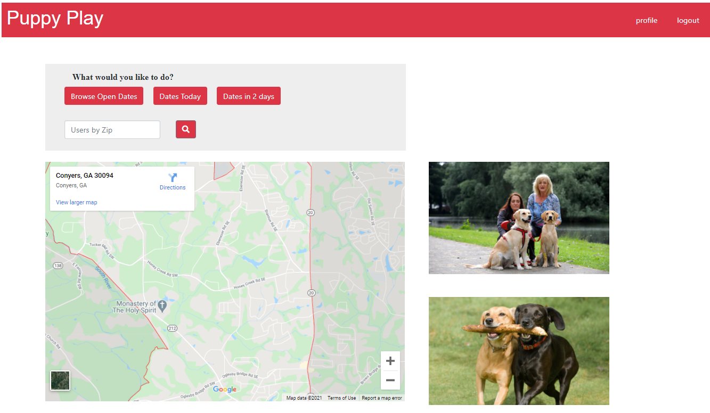

# PlayDate
Together we built an online application where a user can go in and set up puppy play dates. 

##   

## Contact information and Deployment
  Created by: Soumik Das, Aubrey Bennett, Greyson Mainor, Tori Sanford  
  Date: 04/01/2021  
  Contact:  
 - Greyson- gbmainor98@outlook.com
 - Tori- Tori.danielle.clark91@gmail.com
 - Aubrey- 27aubreyb@gmail.com
 - Soumik- contact.soumikdas@gmail.com

Link to deployed project:  https://app-puppy-play.herokuapp.com/  
Screen shot of completed assignment:   
Link to Visual Aid: [Project Presentation](https://www.canva.com/design/DAEad68SKoA/share/preview?token=DEguqKpyeYTSeoA50K5Zfg&role=EDITOR&utm_content=DAEad68SKoA&utm_campaign=designshare&utm_medium=link&utm_source=sharebutton)  

## About this Project: 
One stop shop for users to find their playdates, locally. Users can set up or browse playdates while viewing who would be at each location. 

## What we learned from this project: 
- Greyson- I learned how to use embed maps in an html as well as shortcuts for on clicks when handling basic stuff in the html.
- Soumik - Learned about the overall MVC concepts.  
- Aubrey - I learned about how the authentication process works.
- Tori - Learned how to better use handlebars and deploy to heroku. 

## User Story
When I log on
Then I am greeted with a box inquiring what I am looking for 
Set up play date
When I select Set up a play date
Then I am given an information box
When I enter in the address 
Then I am prompted to select Date
When I enter in the date
Then I am prompted to select a time
Then I am able to save 
Then other users are able to see my post and “click to follow” or “check in” 
Browse play dates
When I select browse
Then I am presented with a box to select miles away
When I select my option
Then I am presented with who is where 
Then I can check in to that location as well 
See upcoming play dates (2 days)
When I select upcoming
Then I am presented with the next 2 days scheduling 
I can then select one to attend by checking in 

## Acceptance Criteria-- MVP
Authentication - User vs guest 
API For Park look up 
A user interface that allows them to place in their profile (human and dog) DB will retain that information. 
Look up of information and input of information that will be the post and pull. 
All locations must have an address associated to them. 

## License  
This app follow **MIT** licensing rules. Please check below link for more details.
    
https://choosealicense.com/licenses/mit/  
   
